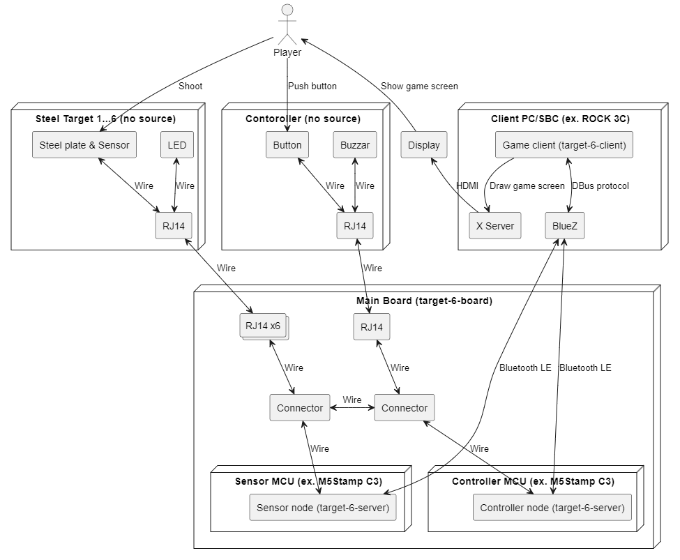

# target-6-client

`target-6` is an opensource steel targets shooting game.

This is a client program to show the graphical interface on a display device.
This client connects to servers via Bluetooth Low Energy (BLE) protocol.

Please refer these repositories if you have interest in other modules of `target-6`.

* Server: https://github.com/katsuster/target-6-server
* Board: https://github.com/katsuster/target-6-board

## Overall

## Requires

* Software
  * Linux
  * Java
  * Maven
  * D-Bus
  * BlueZ
* Hardware
  * x86_64 or ARM machine
  * Bluetooth adapter that is supported by BlueZ

## How to use

* [Build and Run](doc/build.md)
* [Setup Client Machine](doc/setup_linux.md)

## Other documents

* [Single Player Mode](doc/single.md)
