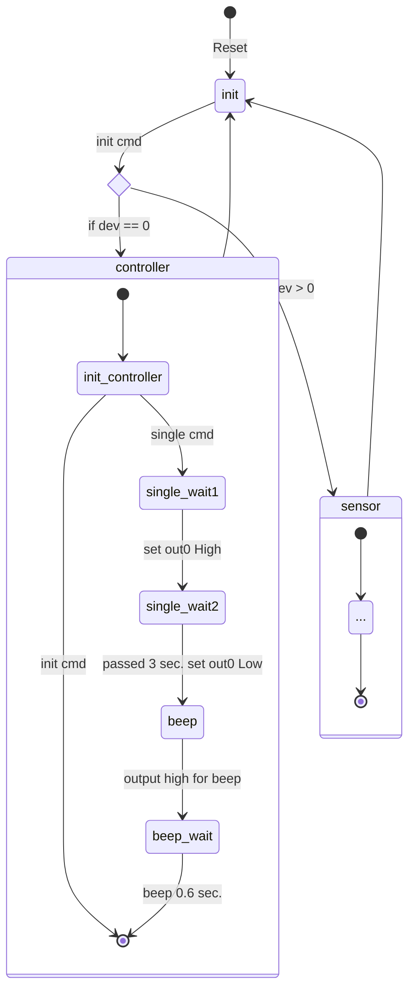
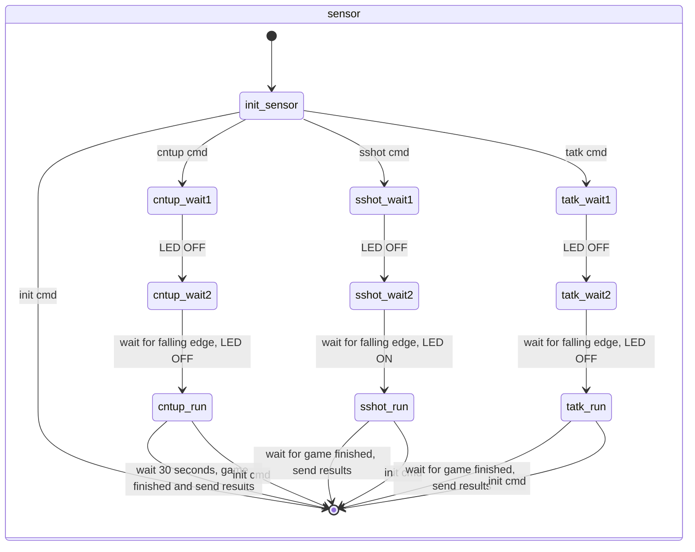
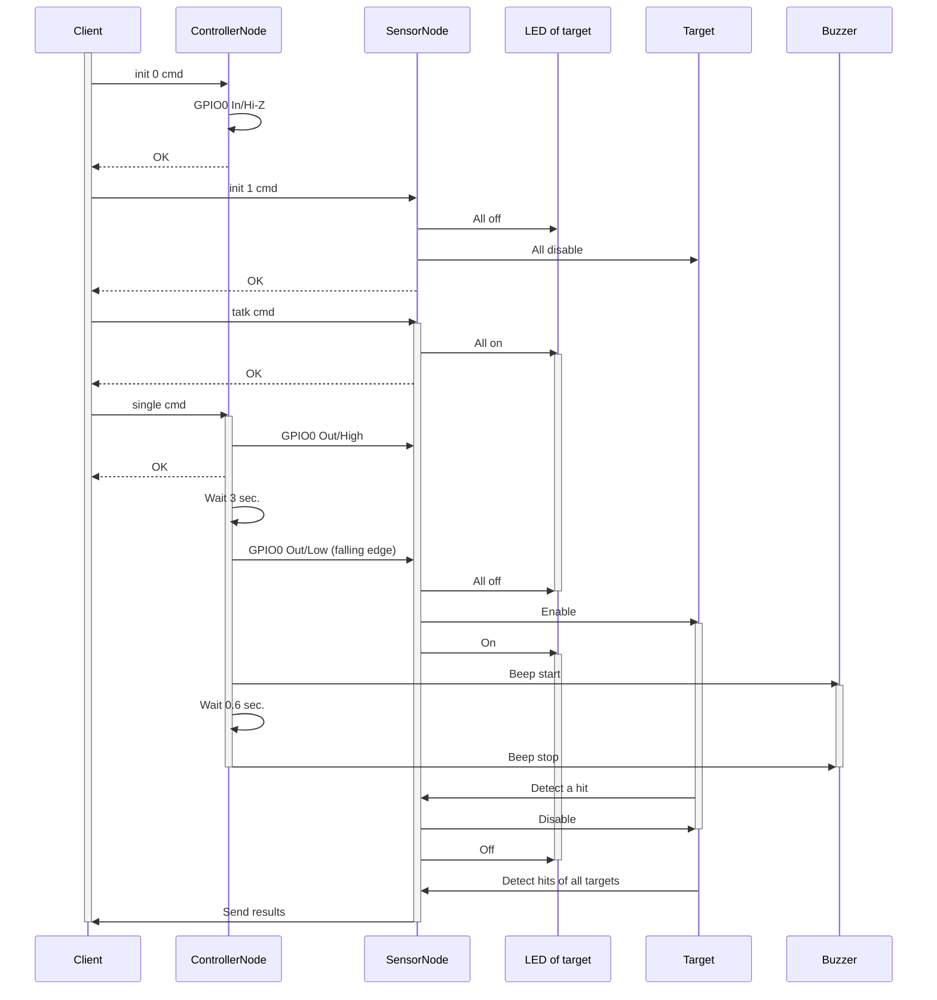
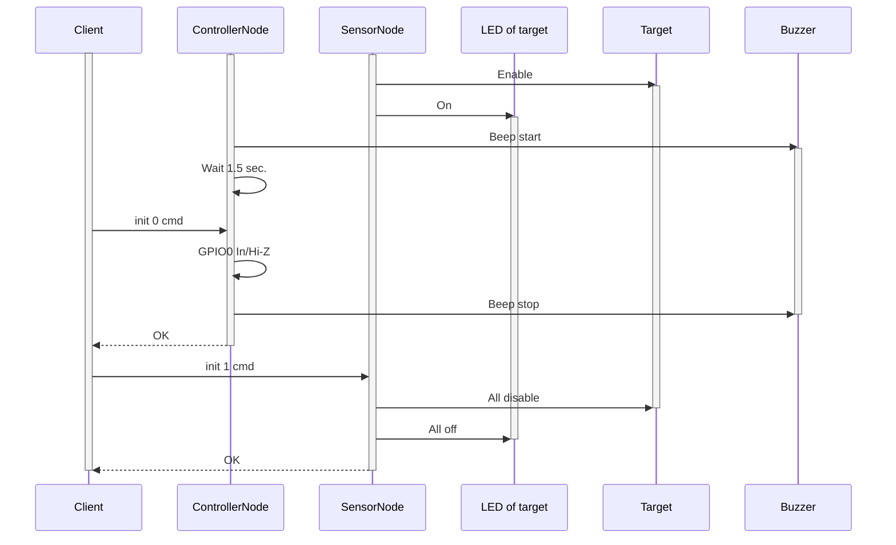

# Single player mode

This document describes specification and implementation of single player mode.

## Specification

Single player mode has 2 games.

* Count up
  * Start by `cntup` command
  * Shoot targets as much as possible
  * Game is finished after 30 seconds
* Speed shoot
  * Start by `sshot` command
  * Shoot all targets as fast as possible (sequence is free)
  * Shoot stop target at last
    * Add penalty (+3 secs) for each non-shoot target
    * Max time is 30 secs
  * Game is finished after 30 seconds
* Time attack
  * Start by `tatk` command
  * Shoot highlighted target as fast as possible (sequence is random)
  * Pass the target if 30 seconds past
  * Game is finished after shoot/pass all targets

Single player mode is using 2 nodes at same time.

* Controller node (device ID: 0)
  * Detect push button
  * Beep the buzzer
  * Send start signal to sensor node
* Sensor node (device ID: 1)
  * Turn ON LEDs of target
  * Detect a hit of target
  * Send results to client

## Implementation

### State

Here is states diagram of controller and sensor node.

### Normal sequence

Here is normal sequence diagram of single mode game.

### Cancel sequence

Here is a sequence for cancel the running game.

