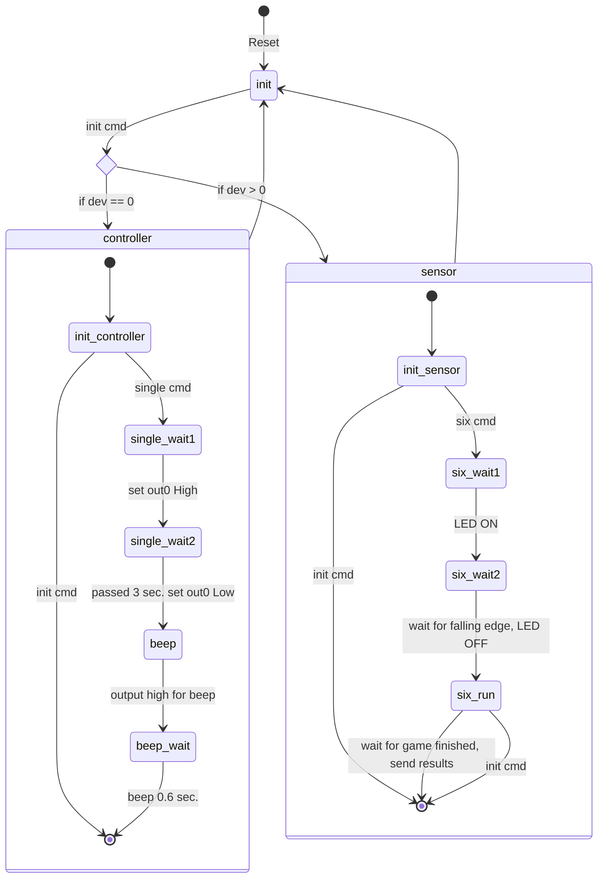
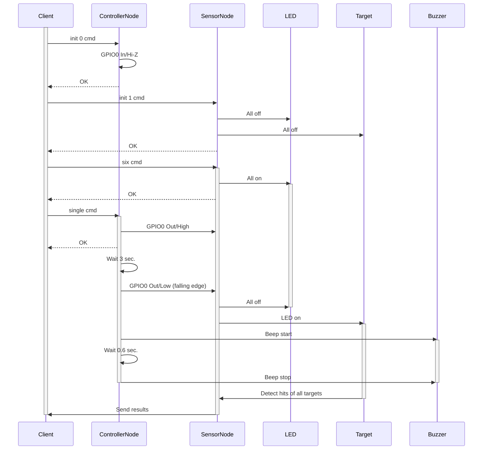
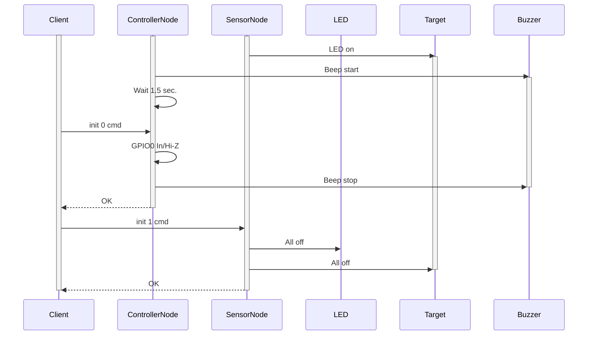

# Single player mode

This document describes specification and implementation of single player mode.

## Specification

Single player mode has 1 game.

* Time attack
  * Shoot all 6 targets as fast as possible

Single player mode is using 2 nodes at same time.

* Controller node (device ID: 0)
  * Detect push button
  * Beep the buzzer
  * Send start signal to sensor node
* Sensor node (device ID: 1)
  * Turn ON LEDs of target
  * Detect a hit of target
  * Send results to client

## Implementation

### State

Here is states diagram of controller and sensor node.

### Normal sequence

Here is normal sequence diagram of single mode game.

### Cancel sequence

Here is a sequence for cancel the running game.

